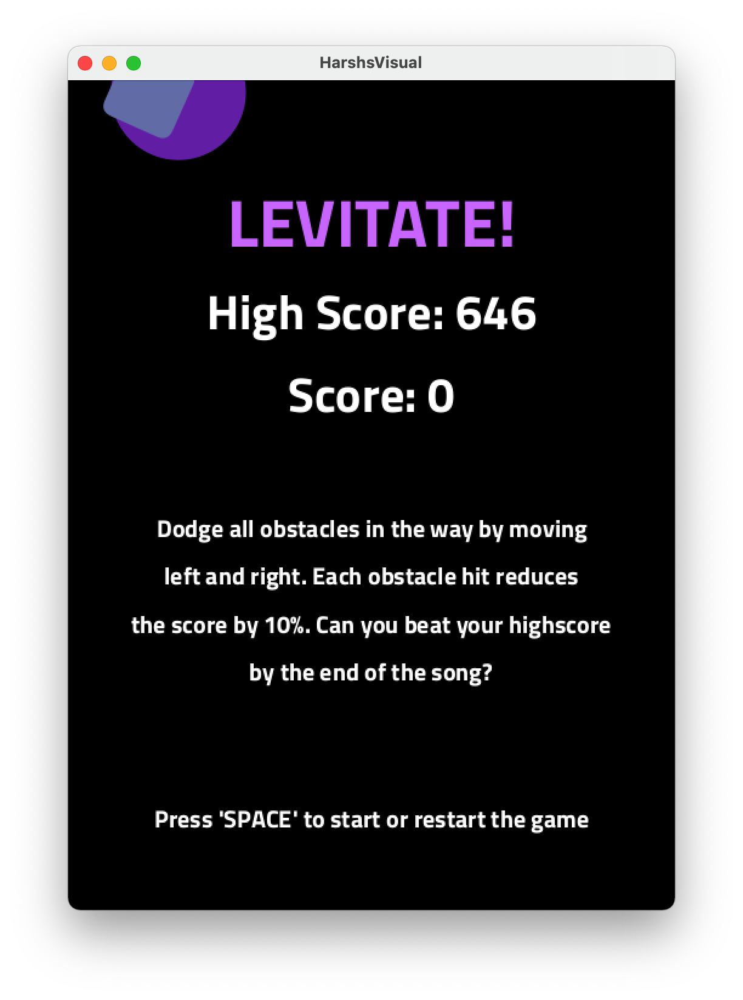
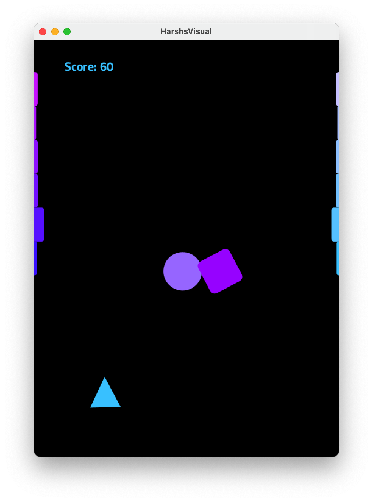
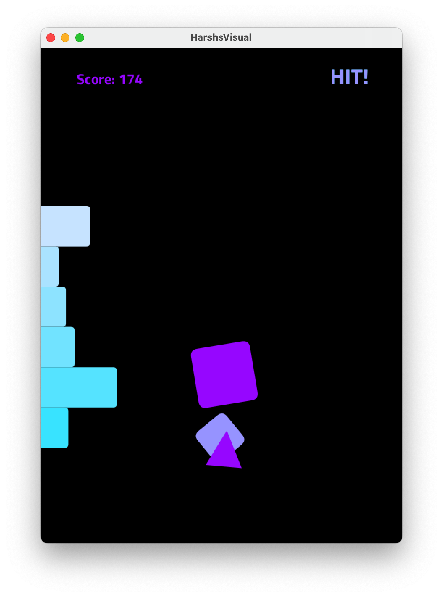
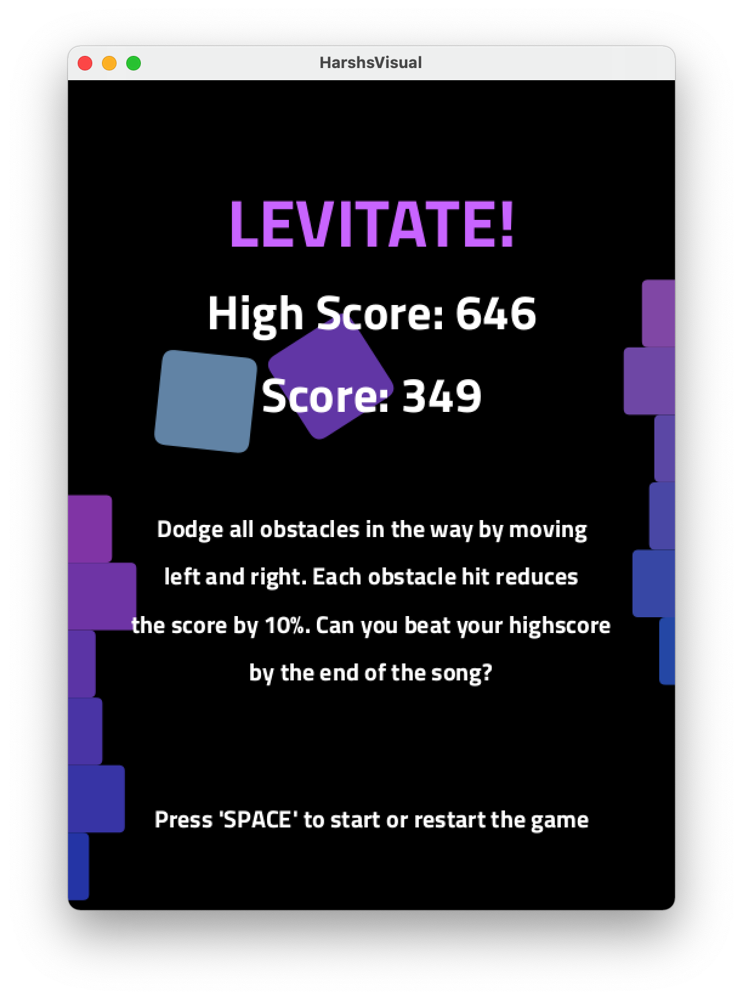

# Music Visualiser Project

Name: Harsh Chandra

Student Number: D18130149

Video: [hyperlink](https://youtu.be/pL-fTdxcWXc)

# Description of the assignment

This assignment is a really interesting, fun and addictive vertical dodging game that generates obstacles based on the music being played. The game also speeds up and increases difficulty depending on the music's frequencies and amplitudes.

The goal of the game is to avoid hitting the obstacles and achieve a highscore by the time the song stops playing. Hitting an obstacle will reduce the score by 10%. The player's movement is limited to the bottom of the screen. Can you beat your own high score?

There are 3 types of obstacles:

- Circle Obstacle - this obstacle scales up and down based on the music amplitude
- Square Obstacle - this obstacle rotates around its center, the rotation speeds up and down with the music
- SideBars Obstacle - this obstacle shows bars based on the frequency bands of the music and blocks the path

# Instructions

After compiling and running the code, you will be presented with the Game Menu Screen



As mentioned on the menu, to start the game press the 'SPACE' key. The music will start the and obstacles will begin to appear. Obstacles are slow in the start as they match with the music. To move the player, simply move the mouse towards the left or right.


As the game progresses, you can see the score on the top left of the screen and the text saying 'HIT' when you hit an obstacle.


As soon as the song ends, the menu appears again with your score and highscore


# How it works

The project consists of 1 interface, 1 abstract class and 6 other classes.

The code implementation starts with the HarshsVisual class which extends the Visual class from the ie.tudublin package, which extends the PApplet. The Player class and the Obstacle abstract class implements the GameObject interface. The player class is responsible for rendering and moving the player on the screen.

The CircleObstacle, SquareObstacle and SideBarsObstacle extend the Obstacle abstract class. Each of these classes are responsible for rendering and updating the position of the various obstacles.

The HarshsVisual sets up everything and in the draw function displays the menu in the start. When the game starts 2 sidebar obstacles on each end and 2 random circle and square obstacles are generated. Thsi class keeps track of the muisc, the game state, an arraylist of obstacles and collisions. Via the draw function, in each frame it draws and updates the position as well as the transformations of all the obstacles and the player. Based on the music's amplitude the game scrolling speed and the roataion and scaling of obstacles is set.

It also tries to detect beats in the music's frequency bands and generates the obstacles. Beats are detecting by taking an average of all the frequency bands and the checking how far is that average from the highest or the lowest point. When its closer to the highest point, it counts it as a beat.

# What I am most proud of in the assignment

In this assignment I am the most proud of the collision detection implementation. It was a tricky thing to do as I have a wide variety of shapes for the obstacles that need to check collision with the player which is a triangle. To implement collision detection I used the java.awt packages.

First I created a shape for each game obstacle and then created an Area object for each one. To check for collision I had to check for the intersection between the areas.

The player was a little tricky as it's a triangle which is not present as a standard shape in the package so I created a java.awt.Polygon object with 3 points.

The circle was the easiest to implement, I used the java.awt.geom.Ellipse2D object for that and for the square I used the java.awt.geom.RoundRectangle2D object for high precision round corners.
For the side bars were the hardest to implement as I had to combine the areas of each side bar together in each frame for higher precision.

Finally, to detect collisions I intersected the area of each Obstacle with the player to see if there was any overlap. If there was an overlap it counted a collision.

```Java
public boolean checkForCollision() {
	Area playerBody = player.getCollisionBody();

	// calculate the overlap between the two areas
	Area overlapArea = (Area) playerBody.clone();
	overlapArea.intersect(getCollisionBody());

	// if overlap area is not empty then collision occured
	if (!overlapArea.isEmpty()) {
		didCollideWithPlayer = true;
		return true;
	} else {
		return false;
	}
}
```
